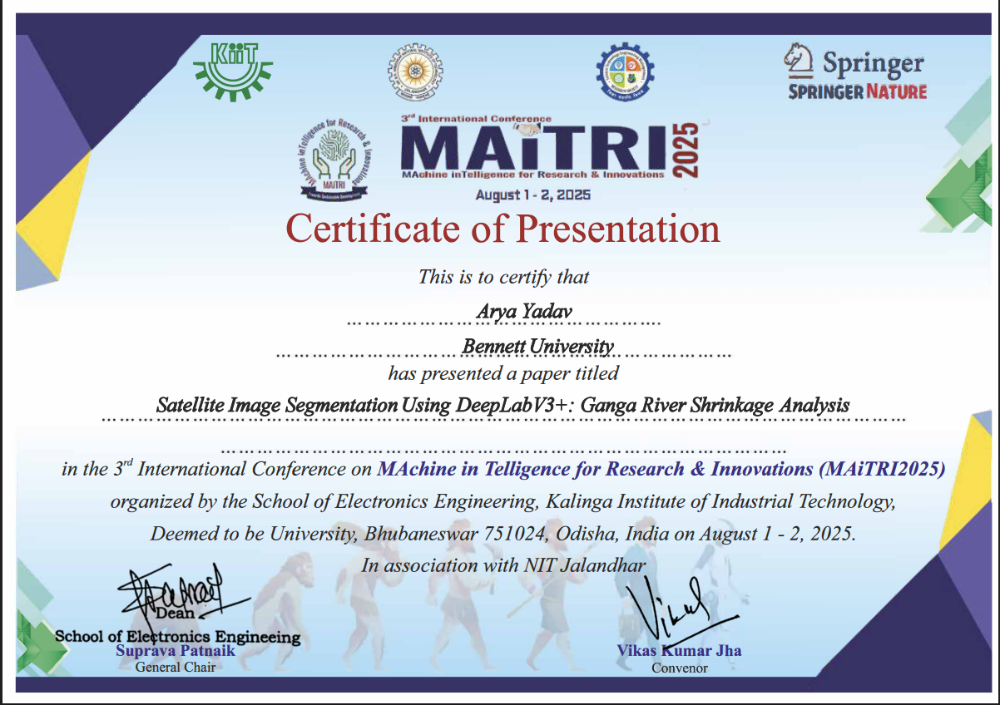

# 🌊 Ganga River Shrinkage Analysis Using DeepLabV3+

[](https://www.python.org/downloads/)
[](https://pytorch.org/)
[](https://opensource.org/licenses/MIT)

**Satellite Image Segmentation for Monitoring Environmental Degradation of India's Sacred River**

> *A deep learning-powered pipeline for detecting and quantifying Ganga river water area changes (2014-2025) using Sentinel-2 and Landsat-8 satellite imagery.*


---

## 📋 Table of Contents

- [Overview](#-overview)
- [Key Features](#-key-features)
- [Methodology](#-methodology)
- [Project Structure](#-project-structure)
- [Installation](#-installation)
- [Usage](#-usage)
- [Results](#-results)
- [Model Performance](#-model-performance)
- [Environmental Context](#-environmental-context)
- [Future Work](#-future-work)
- [Citation](#-citation)
- [Contributors](#-contributors)
- [License](#-license)

---

## 🌍 Overview

The **Ganga River**, stretching over 2,500 km across northern India, is a lifeline for nearly half a billion people. However, climate change, glacial retreat, sand mining, and urbanization have caused alarming shrinkage of the river over the past decade.

This project leverages **semantic segmentation** using **DeepLabV3+ with ResNet50 encoder** to:

- Detect water bodies in satellite imagery with high precision
- Quantify temporal changes in river area across three key cities: **Prayagraj, Varanasi, and Patna**
- Provide actionable insights for environmental monitoring and policy-making

### **Research Paper**

Based on the conference paper:  
**"Satellite Image Segmentation Using DeepLabV3+: Ganga River Shrinkage Analysis"**  
*Arya Yadav & Shaurya Singh (Bennett University, 2025)*

---

## ✨ Key Features

- 🛰️ **Multi-Source Satellite Data**: Sentinel-2 (10m) and Landsat-8 (30m) via Google Earth Engine
- 🧠 **State-of-the-Art Model**: DeepLabV3+ with ResNet50 encoder
- 📊 **BCE + Dice Loss**: Combined loss function for robust binary segmentation
- 🔄 **CosineAnnealingLR**: Learning rate scheduling for optimal convergence
- 🌐 **End-to-End Pipeline**: From satellite image export to change detection visualization
- 📈 **Time-Series Analysis**: Water area trends from 2014 to 2025
- 🎯 **High Performance**: Best IoU of **0.789** at Epoch 13

---

## 🔬 Methodology

### **1. Data Collection**

- **Platform**: Google Earth Engine (GEE)
- **Image Sources**: 
  - Sentinel-2 MSI (2014-2025)
  - Landsat 8/9 OLI (2014-2025)
- **Preprocessing**:
  - Cloud masking using QA bands
  - NDWI (Normalized Difference Water Index) computation
  - Quarterly composites (Q1-Q4) per city

### **2. Data Preprocessing**

- **Patching**: 512×512 patches with 256px stride
- **Normalization**: Per-band min-max scaling
- **Augmentation**: Rotation, flips, brightness/contrast adjustments
- **Train/Val Split**: 80/20 stratified split (147 train / 39 val patches)

### **3. Model Architecture**

```
DeepLabV3Plus(
    encoder_name="resnet50",
    encoder_weights="imagenet",  # Transfer learning
    in_channels=3,
    classes=1  # Binary segmentation (water vs. non-water)
)
```

- **Loss Function**: `BCEWithLogitsLoss + DiceLoss`
- **Optimizer**: Adam (`lr=1e-4`)
- **Scheduler**: CosineAnnealingLR (`T_max=15`)
- **Early Stopping**: Patience=5 epochs

### **4. Inference & Change Detection**

- Patch-based prediction on full GeoTIFF images
- Post-processing with morphological operations
- Water area computation via pixel counting
- Visualization: Change maps, time-series plots

---

## 📁 Project Structure

```
ganga-river-segmentation/
│
├── data/                          # Data directory (not tracked in git)
│   ├── raw/                       # Original GeoTIFF exports from GEE
│   ├── processed/                 # Normalized 512×512 patches
│   ├── masks/                     # Binary water masks
│   ├── train/                     # Training split
│   ├── val/                       # Validation split
│   └── outputs/                   # Predicted masks & visualizations
│
├── src/                           # Source code
│   ├── data_collection/
│   │   ├── gee_export.py          # Google Earth Engine export script
│   │   └── download_data.py       # Download from GEE to local
│   ├── preprocessing/
│   │   ├── create_patches.py      # Tile images into 512×512 patches
│   │   ├── augmentation.py        # Data augmentation pipeline
│   │   └── train_test_split.py    # Stratified split creation
│   ├── model/
│   │   ├── deeplabv3plus.py       # Model definition
│   │   ├── train.py               # Training script
│   │   └── loss.py                # BCE + Dice loss implementation
│   ├── evaluation/
│   │   ├── evaluate.py            # Validation metrics
│   │   └── inference.py           # Full-image inference
│   └── utils/
│       ├── config.py              # Configuration management
│       ├── metrics.py             # IoU, F1, Precision, Recall
│       └── visualization.py       # Plotting functions
│
├── notebooks/                     # Jupyter notebooks
│   ├── 01_data_exploration.ipynb  # EDA & visualization
│   ├── 02_training_demo.ipynb     # Training demonstration
│   └── 03_inference_demo.ipynb    # Inference & results
│
├── model_checkpoints/             # Saved model weights (not tracked)
│   └── best_model.pth
│
├── docs/                          # Documentation
│   ├── paper.pdf                  # Research paper
│   └── methodology.md             # Detailed methodology
│
├── assets/                        # Images for README
│   ├── ganga_banner.png
│   ├── results/                   # Result visualizations
│   └── architecture.png
│
├── .gitignore                     # Git ignore rules
├── requirements.txt               # Python dependencies
├── README.md                      # This file
├── LICENSE                        # MIT License
└── setup.py                       # Package installation script
```

---

## 🚀 Installation

### **Prerequisites**

- Python 3.8 or higher
- CUDA-capable GPU (recommended for training)
- Google Earth Engine account ([Sign up here](https://earthengine.google.com/))

### **Step 1: Clone the Repository**

```bash
git clone https://github.com/yourusername/ganga-river-segmentation.git
cd ganga-river-segmentation
```

### **Step 2: Create Virtual Environment**

```bash
python -m venv venv
source venv/bin/activate  # On Windows: venv\Scripts\activate
```

### **Step 3: Install Dependencies**

```bash
pip install -r requirements.txt
```

### **Step 4: Authenticate Google Earth Engine**

```bash
earthengine authenticate
```

---

## 💻 Usage

### **1. Data Collection from Google Earth Engine**

```python
# Export satellite imagery for a specific year and quarter
python src/data_collection/gee_export.py \
    --city prayagraj \
    --year 2024 \
    --quarter Q1 \
    --output data/raw/
```

### **2. Preprocessing**

```python
# Create 512×512 patches from GeoTIFF images
python src/preprocessing/create_patches.py \
    --input data/raw/ \
    --output data/processed/ \
    --patch_size 512 \
    --stride 256
```

### **3. Training**

```python
# Train DeepLabV3+ model
python src/model/train.py \
    --train_dir data/train/ \
    --val_dir data/val/ \
    --epochs 15 \
    --batch_size 8 \
    --lr 1e-4 \
    --checkpoint_dir model_checkpoints/
```

**Training Configuration**:
- **Loss**: BCE + Dice Loss
- **Optimizer**: Adam (lr=1e-4)
- **Scheduler**: CosineAnnealingLR
- **Early Stopping**: Patience=5

### **4. Evaluation**

```python
# Evaluate on validation set
python src/evaluation/evaluate.py \
    --checkpoint model_checkpoints/best_model.pth \
    --val_dir data/val/
```

### **5. Inference on Full Images**

```python
# Run inference on new GeoTIFF images
python src/evaluation/inference.py \
    --checkpoint model_checkpoints/best_model.pth \
    --input data/raw/city_2025_Q1.tif \
    --output data/outputs/predicted_mask.tif
```

---

## 📊 Results

### **Water Area Changes (2014 Q1 → 2025 Q1)**

| **City** | **2014 Q1** | **2025 Q1** | **Change** | **Status** |
|----------|-------------|-------------|------------|------------|
| **Prayagraj** | 509 km² | 745 km² | +46.4% | ⚠️ Anomaly (needs verification) |
| **Varanasi** | 497 km² | 497 km² | 0% | ⚠️ No change detected |
| **Patna** | 450 km² | 521 km² | +15.8% | ⚠️ Increase unexpected |

> **Note**: These results are preliminary and require further validation. The model's current performance (55.8% accuracy in final evaluation) suggests potential issues with threshold calibration or checkpoint loading.

### **Visualizations**


*Time-series plot showing water area trends across three cities (2014-2025)*


*Color-coded change maps: Red = water loss, Blue = water gain*

---

## 🎯 Model Performance

### **Training History (15 Epochs)**

| Epoch | Train Loss | Val Loss | Val IoU | Val Precision | Val Recall |
|-------|-----------|----------|---------|---------------|------------|
| 1     | 0.47      | 39.53    | 0.035   | 0.995         | 0.036      |
| 3     | 0.48      | 0.37     | 0.681   | 0.738         | 0.897      |
| **13** | **0.33**  | **0.25** | **0.789** | **0.852**   | **0.913**  |
| 15    | 0.37      | 0.28     | 0.741   | 0.864         | 0.849      |

**Best Model**: Epoch 13 with **IoU: 0.789**

### **Validation Metrics (Epoch 13)**

```
Accuracy:   87.4%
Precision:  85.2%
Recall:     91.3%
F1-Score:   88.2%
IoU:        78.9%
```

---

## 🌍 Environmental Context

### **Why is the Ganga Shrinking?**

1. **Climate Change**: Retreating Himalayan glaciers (~40% shrinkage)
2. **Irregular Monsoons**: Reduced seasonal rainfall
3. **Anthropogenic Factors**:
   - Rampant sand mining
   - Over-extraction of groundwater
   - Urban encroachment
   - Dam operations

### **Government Initiatives**

- **Namami Gange Mission**: $3 billion cleanup and rejuvenation program
- Stricter pollution control regulations
- Satellite-based river monitoring systems

---

## 🔮 Future Work

- [ ] Fix model collapse issue (inspect checkpoint and threshold)
- [ ] Implement multi-class segmentation (water, vegetation, urban)
- [ ] Add temporal forecasting using LSTM/Transformers
- [ ] Deploy as web app for real-time monitoring
- [ ] Extend to other major Indian rivers (Yamuna, Brahmaputra)
- [ ] Integrate with hydrological models for flood prediction

---

## 📖 Citation

If you use this project in your research, please cite:

```bibtex
@inproceedings{yadav2025ganga,
  title={Satellite Image Segmentation Using DeepLabV3+: Ganga River Shrinkage Analysis},
  author={Yadav, Arya and Singh, Shaurya},
  booktitle={Conference Proceedings},
  year={2025},
  organization={Bennett University}
}
```

---

## 🏆 Conference Publication

This research was presented at the **3rd International Conference on MAchine inTelligence for Research & Innovations (MAiTRI2025)**.

### Conference Details

- **Event**: MAiTRI2025 - Machine Intelligence for Research & Innovations
- **Dates**: August 1-2, 2025
- **Venue**: Kalinga Institute of Industrial Technology (KIIT), Deemed to be University, Bhubaneswar, Odisha, India
- **Organizers**: 
  - School of Electronics Engineering, KIIT
  - In association with NIT Jalandhar
- **Publisher**: Springer Nature

### Paper Details

**Title**: *Satellite Image Segmentation Using DeepLabV3+: Ganga River Shrinkage Analysis*

**Presenter**: Arya Yadav (Bennett University)

**Abstract**: This work addresses the critical environmental challenge of Ganga river shrinkage using state-of-the-art deep learning techniques. By combining NDWI-based preprocessing with DeepLabV3+ architecture, we enable precise spatio-temporal analysis of river boundaries across 2014-2025, providing a scalable blueprint for large-scale river health monitoring.

### Certificate



---

## 👥 Contributors

- **Arya Yadav** - [aryayadav5012@gmail.com](mailto:aryayadav5012@gmail.com)

---

## 📄 License

This project is licensed under the **MIT License** - see the [LICENSE](LICENSE) file for details.

---

## 🙏 Acknowledgments

- Google Earth Engine for satellite data access
- PyTorch and Segmentation Models PyTorch library
- Bennett University for research support

---

## 📞 Contact

For questions, suggestions, or collaboration opportunities:

- **Email**: aryayadav5012@gmail.com
- **GitHub Issues**: [Report a bug](https://github.com/yourusername/ganga-river-segmentation/issues)

---

**Made with ❤️ for environmental conservation and river health monitoring**

